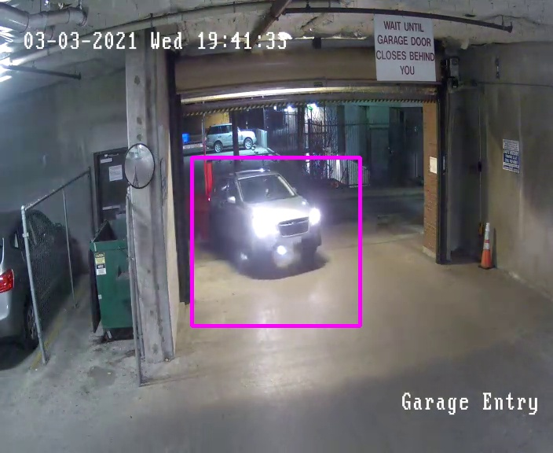
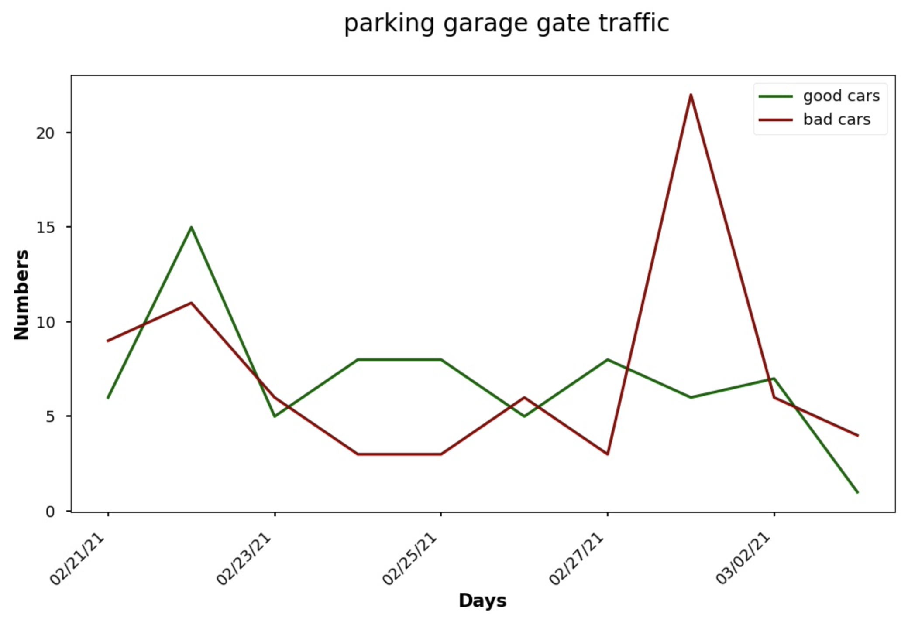

Overview
========

The goal of **carwatch** is to capture a video stream and detect cars waiting at the parking garage gate for it to close before leaving.

When a car is detected, **carwatch** will take a screenshot and save it into a JPG.



**Carwatch** also provides ability to create a weekly report and send it by email once a week with graph and screenshots attached in a zip file.



**Carwatch** is designed to capture a RTSP video stream and run on a Raspberry Pi.

Installation
============

Requirement min Python 3.

OpenCV install on Ubuntu:
```
sudo apt update
sudo apt install libatlas-base-dev
sudo apt install python3-opencv
python3 -c "import cv2; print(cv2.__version__)"
```

OpenCV install on Mac (for testing):
```
brew install opencv
echo 'export PATH="/usr/local/opt/qt/bin:$PATH"' >> ~/.bash_profile
source ~/.bash_profile
```

Python libraries needed:
```
pip3 install opencv-python
pip3 install pytesseract
pip3 install matplotlib
pip3 install pandas
```

After you clone the git repository, rename the file ``config_app.sample.py`` to ``config_app.py`` and edit the mail and RTSP configuration.
You may also tune other detection settings in ``config_detection.py`` which might depend on your camera.

```
cd /home/user/carwatch
nohup python3 carwatch.py 2>&1 &> carwatch.log &
```

Start at the boot, add to the user's crontab, then reboot to test:
```
@reboot cd /home/user/carwatch; nohup python3 carwatch.py 2>&1 &
```

Service Monitor script to make sure the script is restarted in case it dies:
```
*/5 * * * * cd /home/user/carwatch ; ./service_monitor.sh >> carwatch.log
```

